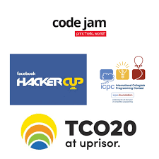

 
 

 

>  **This repository contains <del>all the topics</del> some of the most common topics found in  Competitive Programming contests.**

> **Combined problems that I have solved in this repository according to `Topics`.**
**Feel free to check them out. 😉**

 

##  Topics

|_______|Topic Name|Tutorial|
|--|----------|--------|
|  |[**Graph Theory**](https://github.com/khalid586/Competitive-programming-Topics/tree/main/Graph%20theory)|    |
|  |[**Dynamic Programming**](https://github.com/khalid586/Competitive-programming-Topics/tree/main/Dynamic%20programming)|    |
|  |[**Backtracking**](https://github.com/khalid586/Competitive-programming-Topics/tree/main/Backtracking)|    |
|  |[**Mathematics**](https://github.com/khalid586/Competitive-programming-Topics/tree/main/Mathematics)|    |
|  |[**Number theory**](https://github.com/khalid586/Competitive-programming-Topics/tree/main/Number%20Theory)|    |
|  |[**Prefix sum**](https://github.com/khalid586/Competitive-programming-Topics/tree/main/Prefix%20sum)|    |
|  |[**Segment Tree**](https://github.com/khalid586/Competitive-programming-Topics/tree/main/Segment%20tree)|    |
|  |[**Sorting & Searching**](https://github.com/khalid586/Competitive-programming-Topics/tree/main/Sorting%20and%20Searching)|    |
|  |[**Probabilities**](https://github.com/khalid586/Competitive-programming-Topics/tree/main/Probabilities)|    |
